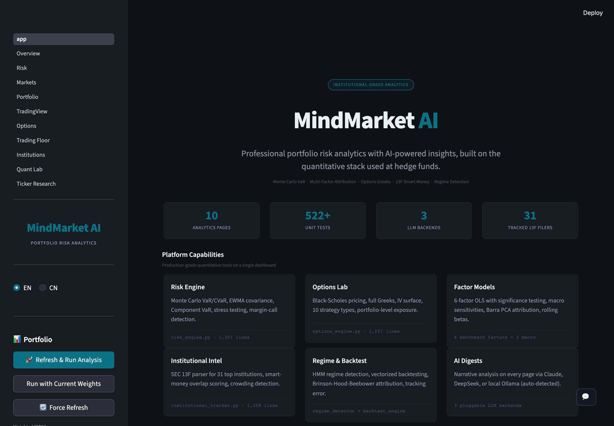
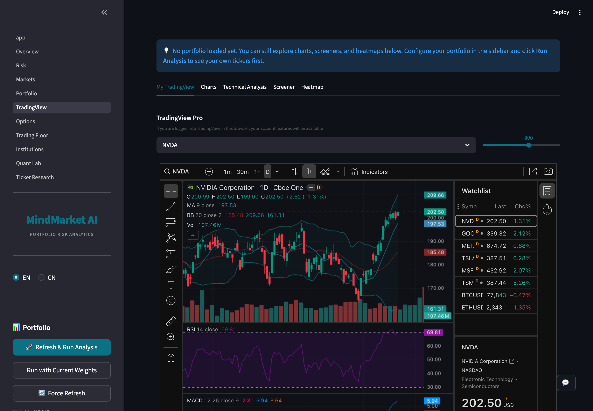
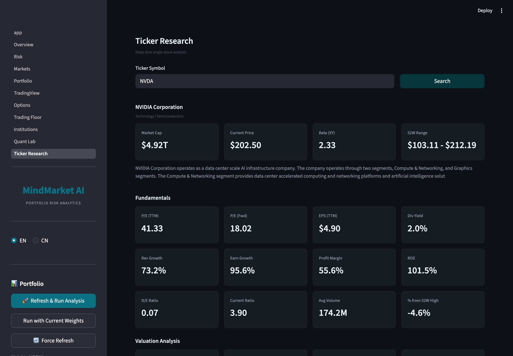
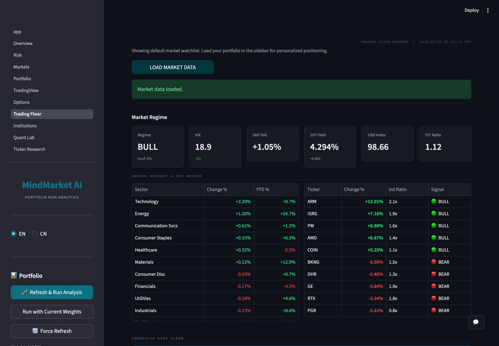

<div align="center">

# 📊 MindMarket AI

### Institutional-Grade Portfolio Risk Analytics · 机构级投资组合风险分析平台

[](https://mindmarketai.streamlit.app/)

[](https://python.org)
[](https://streamlit.io)
[](https://anthropic.com)
[](https://github.com/zhengbrody/PersonalFinancialRiskManagement/actions/workflows/ci.yml)
[](LICENSE)
[]()

**[English](#english) · [中文](#中文)**

</div>

---

<a name="english"></a>

## ⚡ Overview

**MindMarket AI** is an institutional-grade portfolio risk analytics platform built on a production-quality quantitative stack — Monte Carlo VaR, multi-factor attribution, options Greeks, regime detection, SEC 13F tracking, and AI-powered narrative summaries — delivered through a clean 10-page Streamlit dashboard.

> Built to bridge professional hedge-fund analytics and retail-friendly UX.

---

## 📸 Screenshots

<div align="center">


*Landing · feature grid · personas · tech badges*


*Page 5 — Embedded TradingView charts + technical analysis*


*Page 10 — Standalone any-ticker deep dive with AI recommendation*


*Page 7 — Bloomberg-style market monitor*

</div>

---

## 🎯 Core Capabilities

| Domain | Highlights |
|---|---|
| 🛡️ **Risk Engine** | Monte Carlo VaR/CVaR · EWMA covariance (λ=0.94) · Component VaR · Stress testing · Margin-call distance |
| 📈 **Factor Models** | 6-factor OLS with t-statistics · Macro sensitivities (rates/USD/oil) · Barra PCA attribution |
| 🎲 **Options Lab** | Black-Scholes + full Greeks · Newton-Raphson IV · 10 strategy builders · 3D IV surface |
| 🏛️ **Institutional Intel** | SEC 13F parser (top ~30 filers) · Smart-money overlap · Crowding detection · Unusual options flow |
| 🔄 **Regime & Backtest** | HMM (Gaussian mixture EM) · Vectorized backtesting · Brinson-Hood-Beebower attribution |
| 🤖 **AI Digests** | Narrative summaries on every page (Claude / DeepSeek / Ollama with auto-detection) |
| 🌏 **Bilingual UI** | 500+ labels across EN/中文 · dark-mode design system |

---

## 🌐 Live Demo

👉 **[mindmarketai.streamlit.app](https://mindmarketai.streamlit.app/)**

---

## 🗂️ Ten-Page Dashboard

| # | Page | What It Shows |
|---|------|---------------|
| 1 | 🏠 **Overview** | KPIs, cumulative returns, drawdown, cost-basis P&L, AI digest |
| 2 | 🛡️ **Risk** | VaR/CVaR, component VaR, factor betas, 3-mode stress testing, AI risk briefing |
| 3 | 📰 **Markets** | VIX · Fear & Greed · Yield curve · Macro news · AI sentiment (all holdings) · Earnings AI |
| 4 | 💼 **Portfolio** | Efficient frontier · Trade blotter · Scenario simulator (-30% ~ +30%) · Margin monitor |
| 5 | 📉 **TradingView** | Embedded TradingView charts + technical analysis |
| 6 | 🎲 **Options** | Strategy builder · Greeks · IV surface · Educational walkthroughs |
| 7 | 🏙️ **Trading Floor** | Bloomberg-style regime + sectors + movers + options flow |
| 8 | 🏛️ **Institutions** | SEC 13F smart money · Institution deep dive · Options flow intelligence |
| 9 | 🔬 **Quant Lab** | Backtesting · Performance attribution · Regime analysis |
| 10 | 🔎 **Ticker Research** | Standalone any-ticker deep dive (10 data sources + AI recommendation) |

---

## 🚀 Quick Start

### Prerequisites

| Tool | Version | Purpose |
|------|---------|---------|
| Python | 3.10+ | Runtime |
| pip | latest | Package manager |
| Git | any | Clone repo |
| Anthropic API key | optional | Claude AI digests |
| FMP API key | optional | Earnings transcripts / price targets |
| Ollama | optional | Local LLM (auto-detected on port 11434) |

### Option 1 — Native Python

```bash
git clone https://github.com/zhengbrody/PersonalFinancialRiskManagement.git
cd PersonalFinancialRiskManagement
pip install -r requirements.txt
streamlit run app.py
# → http://localhost:8501
```

### Option 2 — Docker

```bash
docker-compose up --build
# → http://localhost:8501
```

### Option 3 — Streamlit Cloud (one-click)

Fork → connect to [share.streamlit.io](https://share.streamlit.io) → set secrets → deploy.

```toml
# .streamlit/secrets.toml
ANTHROPIC_API_KEY = "sk-ant-..."
DEEPSEEK_API_KEY  = "sk-..."
FMP_API_KEY       = "..."
```

---

## 🏗️ Architecture

```
                    ┌─────────────────────┐
                    │  portfolio_config   │  ← Holdings + cost basis
                    └──────────┬──────────┘
                               │
                    ┌──────────▼──────────┐
                    │   data_provider     │  ← yfinance + caching + validation
                    └──────────┬──────────┘
                               │
                ┌──────────────▼──────────────┐
                │      risk_engine.py         │
                │   EWMA · MC VaR · OLS       │
                │   Stress · Frontier · Barra │
                └──────────────┬──────────────┘
                               │
      ┌────────┬────────┬──────┼──────┬────────┬────────┐
      ▼        ▼        ▼      ▼      ▼        ▼        ▼
  options  backtest  regime  vol.  inst.   options   perf.
  engine   engine   detector scan. track.  flow     attrib.
      └────────┴────────┴──────┼──────┴────────┴────────┘
                               │
                     ┌─────────▼─────────┐
                     │    app.py (UI)    │
                     │  10 Streamlit     │
                     │  pages + call_llm │
                     └───────────────────┘
```

---

## 🛠️ Tech Stack

| Layer | Tools |
|-------|-------|
| **UI** | Streamlit · Plotly · custom CSS (dark theme) |
| **Quant** | NumPy · pandas · SciPy (`optimize`, `stats`) |
| **Data** | yfinance · SEC EDGAR · FMP API · CNN Fear & Greed · RSS feeds |
| **AI** | Anthropic Claude · DeepSeek · Ollama (local) |
| **Testing** | pytest · pytest-cov · pytest-asyncio (unit · integration · performance) |
| **Quality** | black · ruff · mypy · pre-commit · GitHub Actions CI |
| **Logging** | structlog · python-json-logger |
| **Deploy** | Docker · docker-compose · Streamlit Cloud |

---

## 🧪 Testing

```bash
# Full suite
python -m pytest tests/ -v

# No coverage (faster)
python -m pytest tests/ --no-cov

# Single module
python -m pytest tests/unit/test_risk_engine.py -v
```

Unit / integration / performance suites. Count the current suite with `python -m pytest tests/ --collect-only -q | tail -1`.

---

## 📂 Project Structure

```
MindMarket AI/
├── app.py                          # Entry · call_llm() · session state
├── risk_engine.py                  # Quant engine (EWMA, VaR, betas, stress)
├── data_provider.py                # Yahoo Finance with caching
├── market_intelligence.py          # News · DCF · insider · Reddit · crypto
├── options_engine.py               # Black-Scholes + Greeks + strategies
├── regime_detector.py              # HMM regime detection
├── institutional_tracker.py        # SEC 13F filing tracker
├── backtest_engine.py              # Vectorized strategy backtest
├── performance_attribution.py      # Brinson + factor attribution
├── volatility_scanner.py           # S&P movers · IV rank · sectors
├── options_flow.py                 # Unusual options activity
├── portfolio_config.py             # Holdings · margin · SECTOR_MAP (canonical)
├── i18n.py                         # Bilingual labels (500+ keys)
│
├── pages/                          # 10 Streamlit pages
│   └── 1_Overview.py ... 10_Ticker_Research.py
│
├── ui/                             # Design system
│   ├── tokens.py                   # Color / spacing / typography tokens
│   ├── components.py               # render_kpi_row · render_ai_digest · etc.
│   ├── shared_sidebar.py           # Provider detection · config
│   ├── floating_chat.py            # Persistent AI chat
│   └── tradingview.py              # TradingView widget integration
│
├── tests/                          # unit · integration · performance
│   ├── unit/ · integration/ · performance/
│
├── docs/
│   ├── user/                       # QUICK_START · SETUP · TROUBLESHOOT
│   └── archive/                    # Historical implementation notes
│
├── requirements.txt · requirements-dev.txt
├── Dockerfile · docker-compose.yml
├── pyproject.toml · pytest.ini · .pre-commit-config.yaml
└── .github/workflows/ci.yml
```

---

## 🗺️ Roadmap

- [x] 10-page analytics dashboard
- [x] Multi-provider LLM integration with auto-detection
- [x] Scenario simulator + cost-basis P&L tracking
- [x] Standalone ticker research page
- [ ] Multi-user auth (Supabase) + per-user portfolios
- [ ] Credit-based AI billing with Stripe
- [ ] Custom domain @ **mindmarket.ai**
- [ ] OAuth broker integration (Robinhood / Moomoo)
- [ ] Email alerts (margin warning, VaR breach)

---

## 📄 License

MIT. See [LICENSE](LICENSE).

---

<a name="中文"></a>

## ⚡ 项目概览

**MindMarket AI** 是一个机构级投资组合风险分析平台，基于专业量化栈构建——蒙特卡洛 VaR、多因子归因、期权希腊字母、市场状态识别、SEC 13F 跟踪、AI 叙述摘要——通过简洁的 10 页 Streamlit 仪表盘呈现。

> 目标：把对冲基金级分析能力与零售友好的 UX 连接起来。

---

## 🎯 核心能力

| 领域 | 亮点 |
|---|---|
| 🛡️ **风险引擎** | 蒙特卡洛 VaR/CVaR · EWMA 协方差（λ=0.94）· 边际 VaR · 压力测试 · 保证金追缴距离 |
| 📈 **因子模型** | 6 因子 OLS（带 t 统计量）· 宏观敏感度（利率/美元/原油）· Barra PCA 归因 |
| 🎲 **期权实验室** | Black-Scholes + 希腊字母 · Newton-Raphson IV · 10 种策略构建器 · 3D 隐波曲面 |
| 🏛️ **机构情报** | SEC 13F 解析器（约 30 家头部机构）· Smart money 重合 · 拥挤度检测 · 异常期权流 |
| 🔄 **状态识别 & 回测** | HMM（高斯混合 EM）· 向量化回测 · Brinson-Hood-Beebower 归因 |
| 🤖 **AI 摘要** | 每页独立的 AI 叙述（Claude / DeepSeek / Ollama 自动检测） |
| 🌏 **双语 UI** | 500+ 标签覆盖英文/中文 · 暗色主题设计系统 |

---

## 🚀 快速开始

### 前置要求

| 工具 | 版本 | 用途 |
|------|------|------|
| Python | 3.10+ | 运行时 |
| pip | 最新 | 包管理器 |
| Git | 任意 | 克隆仓库 |
| Anthropic API 密钥 | 可选 | Claude AI 摘要 |
| FMP API 密钥 | 可选 | 财报电话会 / 目标价 |
| Ollama | 可选 | 本地 LLM（自动检测 11434 端口）|

### 方式一 — 本地 Python

```bash
git clone https://github.com/zhengbrody/PersonalFinancialRiskManagement.git
cd PersonalFinancialRiskManagement
pip install -r requirements.txt
streamlit run app.py
# → http://localhost:8501
```

### 方式二 — Docker

```bash
docker-compose up --build
# → http://localhost:8501
```

### 方式三 — Streamlit Cloud（一键部署）

Fork → 连接到 [share.streamlit.io](https://share.streamlit.io) → 配置 secrets → 部署。

---

## 🧪 测试

```bash
python -m pytest tests/ -v
```

覆盖单元 / 集成 / 性能测试套件。使用 `python -m pytest tests/ --collect-only -q | tail -1` 查询当前测试数量。

---

## 🗺️ 路线图

- [x] 10 页分析仪表盘
- [x] 多后端 LLM 集成 + 自动检测
- [x] 情景模拟器 + 成本基础 P&L 跟踪
- [x] 独立股票研究页面
- [ ] 多用户登录系统（Supabase）
- [ ] 基于积分的 AI 计费（Stripe）
- [ ] 自定义域名 **mindmarket.ai**
- [ ] 券商 OAuth 接入（Robinhood / Moomoo）
- [ ] 邮件提醒（保证金、VaR 突破）

---

<div align="center">

**🔗 [mindmarketai.streamlit.app](https://mindmarketai.streamlit.app/)**

Built with ❤️ by [Zheng Dong](https://github.com/zhengbrody)

_If this project helps, consider leaving a ⭐ — it means a lot._

</div>
