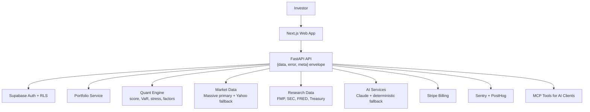

# MindMarket

AI-native portfolio risk cockpit for individual investors.

[](https://mindmarket.app)
[](https://github.com/zhengbrody/PersonalFinancialRiskManagement/actions)
[](LICENSE)

MindMarket helps retail investors move from "I own these tickers" to "I
understand what can hurt this portfolio, why it matters, and what to inspect
next."

Upload holdings, score portfolio health, diagnose risk drivers, simulate
downside scenarios, research individual names, and ask an AI copilot grounded in
the same deterministic metrics the platform shows on screen.

The design principle is simple:

> Quantitative numbers are computed deterministically in Python. The LLM can
> explain, rank, and summarize those numbers, but it must not invent them.

Try the live beta: [mindmarket.app](https://mindmarket.app)

---

## Why This Exists

Most consumer portfolio tools show balances and price charts. Professional risk
systems show factor exposure, downside tails, stress losses, liquidity, and
attribution, but they are hard to use.

MindMarket sits between those worlds:

- Retail-friendly onboarding and portfolio management.
- Institutional-style risk calculations.
- AI explanations that cite computed evidence instead of guessing.
- Clear source provenance for market data.
- A production SaaS foundation: auth, billing, observability, CI, and rollback.

---

## Product Workflow

| Step | What the user gets |
| --- | --- |
| Add holdings | Save tickers, market values, cash, cost basis, and risk preference. |
| Score portfolio | 0-1000 health score across risk match, risk-adjusted return, and downside protection. |
| Diagnose risk | VaR, CVaR, drawdown, factor beta, component VaR, stress losses, and liquidity outliers. |
| Model scenarios | Shock the portfolio and see which holdings drive the loss. |
| Research names | Combine fundamentals, valuation, peers, market data, and AI verdicts. |
| Ask Copilot | Streamed assistant answers using the same API services and source data as the UI. |

---

## Highlights

- **Deterministic quant core**: portfolio scoring, VaR/CVaR, factor betas,
  scenario losses, and drawdown are computed in Python, not by the LLM.
- **Grounded AI layer**: summaries and copilot answers use compact evidence
  packets and fallback templates when the model is unavailable.
- **Provider provenance**: price rows identify whether data came from Massive,
  Yahoo fallback, or remained missing; research and macro fields carry their
  own source labels.
- **Production SaaS plumbing**: Supabase Auth/RLS, Stripe billing, Sentry,
  PostHog, GitHub Actions, GHCR, Docker Compose, and Caddy.
- **Agent-ready backend**: MCP tools expose scoring, market data, macro data,
  and portfolio context to Claude-compatible clients.

---

## System Architecture

MindMarket is a split-stack application:


```mermaid
flowchart TD
  User["Investor"]
  Web["Next.js Web App"]
  API["FastAPI API<br/>{data, error, meta} envelope"]

  User --> Web
  Web --> API

  API --> Auth["Supabase Auth + RLS"]
  API --> Portfolio["Portfolio Service"]
  API --> Quant["Quant Engine<br/>score, VaR, stress, factors"]
  API --> Data["Market Data<br/>Massive primary + Yahoo fallback"]
  API --> Research["Research Data<br/>FMP, SEC, FRED, Treasury"]
  API --> AI["AI Services<br/>Claude + deterministic fallback"]
  API --> Billing["Stripe Billing"]
  API --> Observability["Sentry + PostHog"]
  API --> MCP["MCP Tools for AI Clients"]
```

### Production Routing

| Path | Service |
| --- | --- |
| `/` | Next.js frontend |
| `/api/v1/*` | FastAPI backend |
| `/legacy/*` | Legacy Streamlit app, retained as a rollback surface |
| `/mcp` / stdio | MCP tools for AI clients |

The production deployment uses Docker Compose, Caddy, GitHub Actions, and GHCR
images. Frontend and backend images are built off-box in GitHub Actions so the
small EC2 instance never runs a memory-heavy `next build`.

---

## Built With

| Layer | Choices |
| --- | --- |
| Frontend | Next.js 14 App Router, TypeScript, Tailwind CSS, shadcn-style primitives, React Query, Zod |
| Backend | FastAPI, Pydantic, typed response envelope, PyJWT/JWKS auth verification |
| Quant | NumPy, pandas, SciPy, custom portfolio scoring and risk engine |
| Data | Massive Stocks, Yahoo Finance fallback, FMP, FRED CSV, Treasury CSV, SEC EDGAR |
| Auth + DB | Supabase Auth, Postgres, Row Level Security |
| AI | Anthropic Claude, deterministic fallback templates, MCP tool surface |
| Payments | Stripe Checkout, Customer Portal, Supabase webhook sync |
| Observability | Sentry, PostHog, structured logs |
| Deploy | Docker, Caddy, GitHub Actions, GHCR, AWS EC2 |

---

## Repository Layout

```text
.
├── frontend/              # Next.js SaaS frontend
├── backend/               # FastAPI API, schemas, services, MCP server, tests
├── engine/                # Deterministic portfolio scoring engine
├── domain/                # Shared Pydantic domain models
├── libs/                  # Auth, billing, analysis, risk, data-quality helpers
├── supabase/              # Database migrations and edge functions
├── docs/                  # ADRs, AWS runbooks, SEO notes, legal docs
├── infra/                 # Historical AWS CDK experiments and runbooks
├── pages/, app.py, ui/    # Legacy Streamlit surface retained under /legacy
├── compose.split.yml      # Production split-stack compose file
├── Caddyfile.split        # Production routing
└── .github/workflows/     # CI and GHCR image builds
```

---

## Quick Start

### 1. Clone

```bash
git clone https://github.com/zhengbrody/PersonalFinancialRiskManagement.git
cd PersonalFinancialRiskManagement
```

### 2. Backend

```bash
python -m venv .venv
source .venv/bin/activate
pip install -r requirements.txt
pip install -r backend/requirements-backend.txt

uvicorn backend.app.main:app --reload --port 8000
```

Open the API docs:

```text
http://localhost:8000/docs
```

### 3. Frontend

```bash
cd frontend
npm install
cp .env.example .env.local
npm run dev
```

Open:

```text
http://localhost:3000
```

The public score demo works without Supabase. Login, saved portfolios, billing,
and owner dashboards need the environment variables below.

---

## Environment Variables

Never commit real secrets. Use `.env`, `frontend/.env.local`, GitHub Actions
Variables/Secrets, or the EC2 `.env` file.

### Frontend

| Variable | Required | Notes |
| --- | --- | --- |
| `NEXT_PUBLIC_API_BASE_URL` | Recommended | Use `https://mindmarket.app` in production, `http://localhost:8000` locally. |
| `NEXT_PUBLIC_SUPABASE_URL` | Auth | Public Supabase project URL. |
| `NEXT_PUBLIC_SUPABASE_ANON_KEY` | Auth | Public browser anon key. |
| `NEXT_PUBLIC_SENTRY_DSN` | Optional | Public browser DSN for frontend errors. |
| `NEXT_PUBLIC_POSTHOG_KEY` | Optional | Product analytics key. |
| `NEXT_PUBLIC_POSTHOG_HOST` | Optional | Usually `https://us.i.posthog.com` for US PostHog Cloud. |

### Backend

| Variable | Required | Notes |
| --- | --- | --- |
| `MINDMARKET_ENV` | No | `dev`, `staging`, or `production`. |
| `MINDMARKET_ALLOWED_ORIGINS` | Production | Comma-separated CORS allow-list. |
| `SUPABASE_URL` | Auth | Supabase project URL, also used for JWKS verification. |
| `SUPABASE_JWT_SECRET` | Legacy auth | Needed only for HS256 Supabase JWT projects. |
| `SUPABASE_ANON_KEY` | Auth | Used for Supabase client parity. |
| `ANTHROPIC_API_KEY` | AI | Server-side only. |
| `STRIPE_SECRET_KEY` | Billing | Server-side only. |
| `STRIPE_PRICE_BASIC`, `STRIPE_PRICE_PRO` | Billing | Stripe price ids. |
| `FMP_API_KEY` | Research | Fundamentals, analyst, peers, valuation data. |
| `MASSIVE_API_KEY` | Market data | Primary price/history source when configured; Yahoo Finance remains fallback. |
| `SENTRY_DSN` | Observability | Backend Sentry DSN. |

---

## Data Provider Policy

MindMarket separates market data by job:

| Provider | Role |
| --- | --- |
| Massive Stocks | Primary price/history/OHLC provider when configured. |
| Yahoo Finance | Free fallback for prices/history when Massive is missing, rate-limited, or unavailable. |
| FMP | Fundamentals, valuation, analyst, profile, peers, and research context. |
| FRED + Treasury | Macro rates, inflation, unemployment, and yield curve snapshots. |

Every market price row carries provenance so the UI and API can report whether a
number came from `massive`, `yfinance`, or a missing-data fallback. Missing data
should degrade gracefully; it should not become fabricated data.

---

## API Contract

FastAPI responses use a consistent envelope:

```json
{
  "data": {},
  "error": null,
  "meta": {
    "request_id": "req_...",
    "elapsed_ms": 12
  }
}
```

On failure:

```json
{
  "data": null,
  "error": {
    "code": "unauthorized",
    "message": "Token is invalid or expired.",
    "details": {}
  },
  "meta": {
    "request_id": "req_...",
    "elapsed_ms": 4
  }
}
```

Useful local smoke tests:

```bash
curl -s http://localhost:8000/api/v1/health

curl -s "http://localhost:8000/api/v1/market/prices?tickers=SPY,BND"

curl -s -X POST http://localhost:8000/api/v1/risk/score \
  -H "Content-Type: application/json" \
  -d '{"holdings":[{"ticker":"SPY","market_value":60000},{"ticker":"BND","market_value":40000}],"risk_preference":3}'
```

---

## Development Commands

### Backend

```bash
python -m pytest backend/tests -q --no-cov
python -m black --check backend
python -m ruff check backend
```

### Frontend

```bash
cd frontend
npm run lint
npm run test -- --run
npx tsc --noEmit
npm run build
```

### Legacy Streamlit

```bash
streamlit run app.py
```

Legacy Streamlit is kept for rollback and historical workflows. New product
development should target `frontend/` and `backend/`.

---

## Testing Strategy

The test suite is designed to run offline:

- Backend endpoint contract tests use local fixtures and mocked providers.
- JWT tests mint local tokens and verify fail-closed behavior.
- Frontend tests mock API envelopes and exercise loading, error, and auth states.
- Market data code degrades to partial results instead of hard failing when a
  provider is unavailable.

Before opening a PR, run the backend and frontend gates listed above.

---

## Deployment

Production deploys are pull-only on EC2:

1. Merge to `main`.
2. GitHub Actions builds frontend/backend images on hosted runners.
3. Images are pushed to GHCR.
4. EC2 pulls images and recreates the relevant containers.
5. Caddy routes `/`, `/api/v1/*`, and `/legacy/*`.

Key files:

| File | Purpose |
| --- | --- |
| `.github/workflows/build-images.yml` | Build and push GHCR images. |
| `compose.split.yml` | Split-stack production services. |
| `Caddyfile.split` | Production routing. |
| `docs/aws/ci-image-deploy.md` | CI image deploy runbook. |
| `docs/aws/operations.md` | Operations checklist. |

Do not build the Next.js image on the t3.micro host. That already caused an OOM
incident; the repository now uses off-box GHCR builds.

---

## Security and Privacy

- Supabase Row Level Security is the database boundary for user portfolios.
- Backend routes verify Supabase JWTs and fail closed when auth config is missing.
- Service-role keys, Stripe keys, Anthropic keys, and data-provider keys are
  server-side only.
- Browser analytics must not include tickers, position sizes, portfolio ids, or
  dollar values.
- This project is financial analytics software, not investment advice.

---

## Documentation

| Document | Description |
| --- | --- |
| [`docs/adr/0004-fastapi-nextjs-migration.md`](docs/adr/0004-fastapi-nextjs-migration.md) | Migration strategy from monolith to split stack. |
| [`docs/aws/operations.md`](docs/aws/operations.md) | Production operations runbook. |
| [`docs/aws/ci-image-deploy.md`](docs/aws/ci-image-deploy.md) | GHCR deploy process. |
| [`docs/aws/cloudflare-setup.md`](docs/aws/cloudflare-setup.md) | Putting Cloudflare in front of the origin (hide IP, DDoS/WAF, CDN). |
| [`docs/seo/google_indexing.md`](docs/seo/google_indexing.md) | Search indexing notes. |
| [`docs/legal/disclaimer.md`](docs/legal/disclaimer.md) | Financial disclaimer. |
| [`backend/README.md`](backend/README.md) | Backend API development notes. |
| [`frontend/README.md`](frontend/README.md) | Frontend development notes. |

---

## Roadmap

Near-term:

- Improve the Health Score and Risk Report cockpit with richer interaction.
- Expand ticker research with stronger provider coverage and confidence labels.
- Add owner dashboard polish for signups, activation, retention, and usage cost.
- Continue reducing market-data gaps with explicit provider provenance.

Later:

- Broker import integrations.
- Tax-aware portfolio actions.
- Alerting for drawdown, VaR, concentration, and liquidity events.
- Mobile-native workflows.

---

## Contributing

This repository is maintained like a production SaaS codebase:

1. Keep quant math deterministic and tested.
2. Keep LLM output grounded in computed data.
3. Preserve the response envelope contract.
4. Add tests for API contracts, auth behavior, and user-facing regressions.
5. Do not commit secrets, generated caches, coverage output, or local media.

For substantial changes, open a PR with:

- What changed.
- Why it changed.
- How it was tested.
- Any rollout or rollback notes.

---

## License

MIT. See [`LICENSE`](LICENSE).

---

## Disclaimer

MindMarket provides educational portfolio analytics and software demonstrations.
It does not provide investment, tax, legal, or financial advice.
