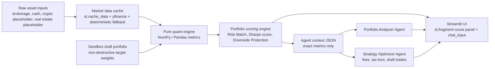

# Portfolio Copilot Beta Architecture



## Design Notes

- Streamlit remains the beta front end; the scoring panel is isolated behind
  `st.fragment` when available, and market downloads are cached with
  `st.cache_data(ttl=3600)`.
- Sharpe, volatility, beta, VaR, CVaR, and max drawdown are computed locally in
  `libs/mindmarket_core/portfolio_scoring.py`.
- Agents in `libs/ai_agents/portfolio_agents.py` are intentionally lightweight:
  deterministic Python tools run first, then an optional LLM only formats the
  already-computed facts.
- The sandbox uses `create_draft_positions()` to produce a draft portfolio from
  normalized target weights without mutating live holdings.

## Standalone `app.py` Shape

The beta page follows this runnable Streamlit structure:

```python
render_shared_sidebar()
base_positions = demo_asset_positions(100_000)
market_returns = _load_market_returns(_public_tickers(base_positions))
score = score_portfolio(base_positions, market_returns, benchmark_returns=market_returns["SPY"])

_render_scoring_panel(score, market_source)
render_asset_table(base_positions)

if st.toggle("Create Draft Portfolio"):
    draft_positions = create_draft_positions(base_positions, slider_weights)
    draft_score = score_portfolio(draft_positions, market_returns, benchmark_returns=market_returns["SPY"])
    render_current_vs_draft(score, draft_score)

if prompt := st.chat_input("Ask the MindMarket AI copilot about this portfolio"):
    result = PortfolioAgentRouter().route(prompt, score_or_draft_score, positions_or_draft_positions)
    st.markdown(result.response_markdown)
```
