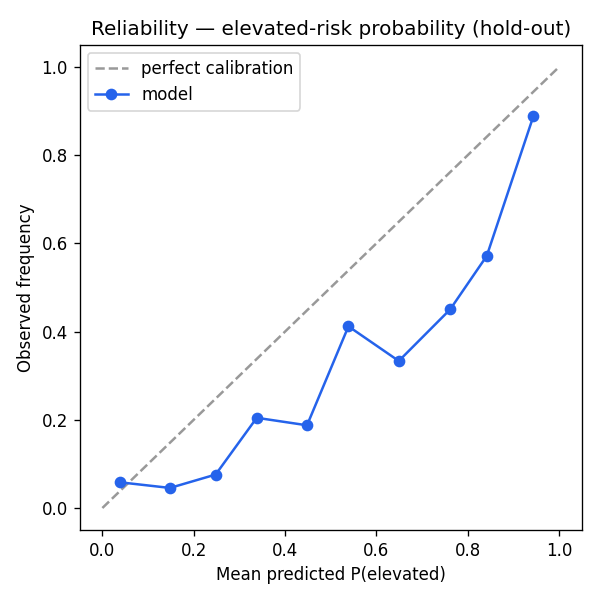

# Risk-Today Regime Classifier — Validation Report

_Auto-generated by `python -m backend.app.ml.validate` — do not edit by hand._

- **Data window:** 2012-06-12 → 2026-06-22 (3526 labeled rows)
- **Config:** seed 42 · 5 expanding folds · hold-out 20% · model_version regime-v1.1.0
- **Discipline:** all boundaries chronological (`TimeSeriesSplit` + final hold-out); a `horizon`-row PURGE/EMBARGO removes training labels whose forward window overlaps the test period; no random eval splits; the persistence baseline uses only labels observable at prediction time (ŷ(t) = y(t−horizon)).

## Walk-forward folds

| Fold | Test window | n | Acc | Macro-F1 | Log-loss | Majority acc | Persistence acc | Logistic acc |
|---|---|---|---|---|---|---|---|---|
| 1 | 2014-10-17 → 2017-02-15 | 587 | 0.4702 | 0.2397 | 1.5546 | 0.5588 | 0.5077 | 0.4668 |
| 2 | 2017-02-16 → 2019-06-18 | 587 | 0.6627 | 0.3222 | 0.9529 | 0.6934 | 0.6985 | 0.6610 |
| 3 | 2019-06-19 → 2021-10-14 | 587 | 0.4395 | 0.3859 | 1.6202 | 0.4753 | 0.5043 | 0.3629 |
| 4 | 2021-10-15 → 2024-02-15 | 587 | 0.3697 | 0.2827 | 1.7842 | 0.2743 | 0.4600 | 0.4395 |
| 5 | 2024-02-16 → 2026-06-22 | 587 | 0.5060 | 0.3643 | 1.1048 | 0.4957 | 0.4446 | 0.5128 |

## Model vs baselines (mean fold accuracy)

| Candidate | Mean accuracy |
|---|---|
| **HistGBM (the model)** | **0.4896** |
| Majority class | 0.4995 |
| Persistence (y at t−horizon) | 0.5230 |
| Logistic regression | 0.4886 |

Log-loss rows marked — mean a fold's training window never saw some test class (the skipped-row counts are in the JSON payload); majority and persistence emit no probabilities, so log-loss applies only to the model and the logistic baseline.

## Calibration — elevated-risk probability (hold-out)

Target: P(elevated risk) = P(volatile) + P(stress) · hold-out 706 rows · base rate 0.1303 · Brier 0.1042 (base-rate reference 0.1133)

| Predicted bin | n | Mean predicted | Observed frequency |
|---|---|---|---|
| [0.0, 0.1) | 361 | 0.0393 | 0.0582 |
| [0.1, 0.2) | 110 | 0.1480 | 0.0455 |
| [0.2, 0.3) | 66 | 0.2479 | 0.0758 |
| [0.3, 0.4) | 44 | 0.3380 | 0.2045 |
| [0.4, 0.5) | 32 | 0.4480 | 0.1875 |
| [0.5, 0.6) | 34 | 0.5387 | 0.4118 |
| [0.6, 0.7) | 9 | 0.6489 | 0.3333 |
| [0.7, 0.8) | 20 | 0.7612 | 0.4500 |
| [0.8, 0.9) | 21 | 0.8415 | 0.5714 |
| [0.9, 1.0] | 9 | 0.9438 | 0.8889 |

## Permutation feature importance (macro-F1, full fit)

| Feature | Importance |
|---|---|
| `vol_63d` | 0.16826 |
| `vix_level` | 0.15203 |
| `golden_cross` | 0.0927 |
| `vol_ratio` | 0.08449 |
| `yield_slope` | 0.08007 |
| `mom_60d` | 0.06204 |
| `vol_21d` | 0.05748 |
| `qqq_trend` | 0.03915 |
| `trend_sma50` | 0.03626 |
| `drawdown` | 0.03619 |
| `qqq_spy_spread` | 0.03188 |
| `vix_change_5d` | 0.02586 |
| `mom_20d` | 0.02429 |
| `vix_term` | 0.0176 |
| `trend_sma200` | 0.01052 |

## Honest notes

- The estimator's internal `early_stopping` split is seeded but shuffled within each fit (see the model card's limitations).
- 4-class accuracy near the majority baseline is expected; the product-relevant signal is the elevated-risk probability, whose calibration is tabled above.
- Persistence is a STRONG baseline (regimes persist) — judge the model on the calibrated elevated-risk probability, not on beating persistence at 4-class point calls.
- Calibration bins sit on OVERLAPPING 10-day forward windows: adjacent rows share 9/10 return days, so the effective sample is roughly n/horizon and sparse upper bins may reflect only a couple of market episodes — read them as direction, not precision.
